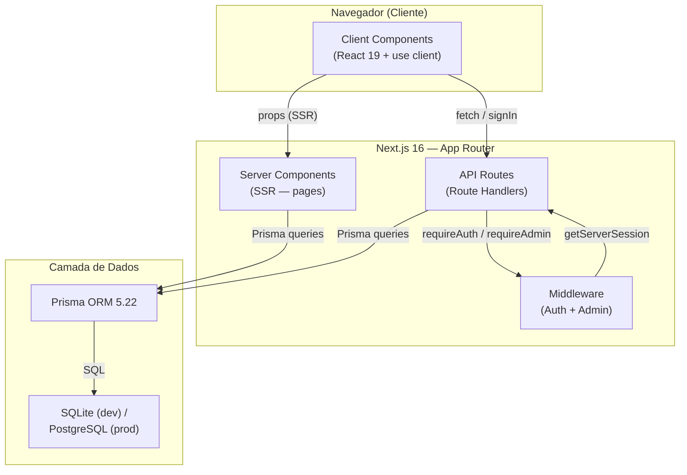
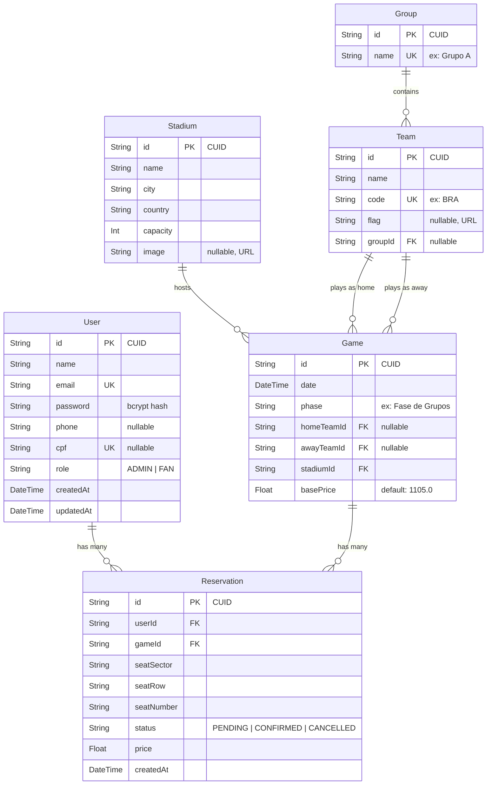
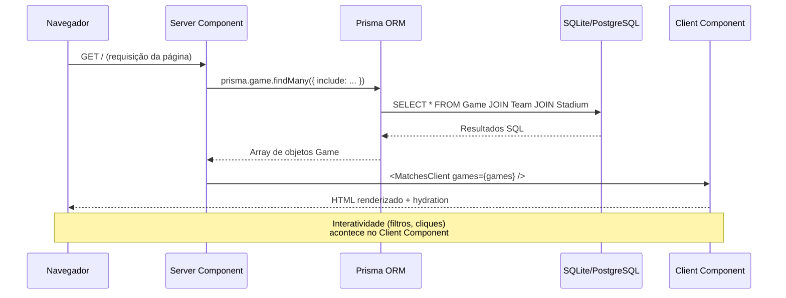
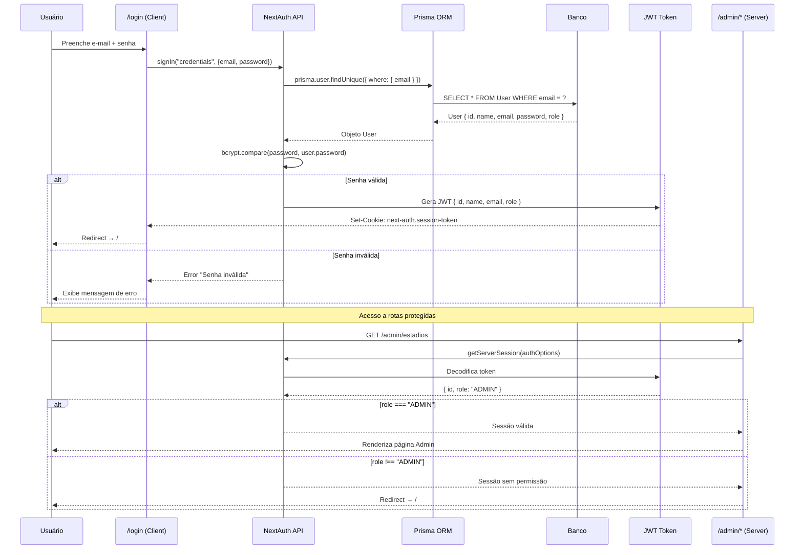
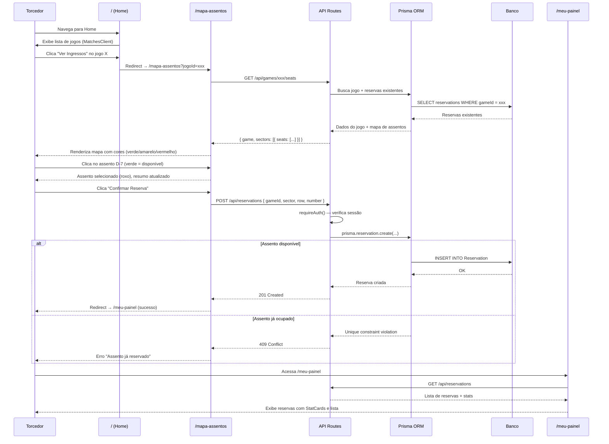

# Design Detalhado do Software — FIFA World Cup Booking

**Projeto:** FIFA World Cup 2026 — Booking  
**Versão:** 1.0  
**Data:** Junho de 2026

---

## 1. Arquitetura Geral do Sistema

O sistema segue a arquitetura **monolítica full-stack** do Next.js 16 (App Router), onde frontend e backend coexistem no mesmo projeto.

### Camadas

| Camada | Responsabilidade | Exemplos |
|--------|-----------------|----------|
| **Client Components** | Interatividade, formulários, estado local, navegação | `Header`, `Sidebar`, `MatchesClient`, `StadiumsClient`, formulários de login/cadastro |
| **Server Components** | Busca de dados no servidor (SSR), renderização inicial | `page.js` (Home), `estadios/page.js` |
| **API Routes** | Endpoints REST, lógica de negócio, validações | `/api/auth/*`, `/api/stadiums/*`, `/api/reservations/*` |
| **Middleware** | Autenticação (`requireAuth`), autorização (`requireAdmin`) | `src/lib/auth.js` |
| **Prisma ORM** | Abstração do banco, queries type-safe, migrações | `src/lib/prisma.js`, `prisma/schema.prisma` |
| **Banco de Dados** | Persistência de dados | SQLite (dev) / PostgreSQL (prod) |

---

## 2. Diagrama de Componentes

```mermaid
graph TD
    subgraph "Layout Raiz (layout.js)"
        Providers["Providers (SessionProvider)"]
        Header["Header"]
        Sidebar["Sidebar"]
    end

    subgraph "Componentes UI Reutilizáveis (ui/)"
        Button["Button"]
        InputField["InputField"]
        StatCard["StatCard"]
        StatusBadge["StatusBadge"]
        SectionTitle["SectionTitle"]
        Card["Card"]
        AuthLayout["AuthLayout"]
        ConfirmModal["ConfirmModal"]
        DataTable["DataTable"]
    end

    subgraph "Páginas Públicas"
        Home["/ (Home)"]
        Login["/login"]
        Cadastro["/cadastro"]
        Estadios["/estadios"]
        MapaAssentos["/mapa-assentos"]
        MeuPainel["/meu-painel"]
        Sobre["/sobre"]
    end

    subgraph "Componentes de Dados (Client)"
        MatchesClient["MatchesClient"]
        StadiumsClient["StadiumsClient"]
        StadiumFormModal["StadiumFormModal"]
        GameFormModal["GameFormModal"]
    end

    subgraph "Páginas Admin (/admin)"
        AdminLayout["AdminLayout"]
        AdminSidebar["AdminSidebar"]
        AdminDash["/admin (Dashboard)"]
        AdminEst["/admin/estadios"]
        AdminJogos["/admin/jogos"]
        AdminRes["/admin/reservas"]
    end

    %% Dependências
    Header --> Sidebar
    Header --> Button
    Home --> MatchesClient
    MatchesClient --> Button
    Login --> AuthLayout
    Login --> InputField
    Login --> Button
    Cadastro --> AuthLayout
    Cadastro --> InputField
    Cadastro --> Button
    Estadios --> StadiumsClient
    StadiumsClient --> SectionTitle
    StadiumsClient --> StatCard
    StadiumsClient --> Card
    MapaAssentos --> Button
    MapaAssentos --> Card
    MeuPainel --> StatCard
    MeuPainel --> StatusBadge
    MeuPainel --> Card
    MeuPainel --> Button
    MeuPainel --> ConfirmModal
    Sobre --> SectionTitle
    Sobre --> StatCard
    Sobre --> Button

    AdminLayout --> AdminSidebar
    AdminEst --> DataTable
    AdminEst --> StadiumFormModal
    AdminEst --> ConfirmModal
    AdminJogos --> DataTable
    AdminJogos --> GameFormModal
    AdminJogos --> ConfirmModal
    AdminRes --> DataTable
    AdminRes --> StatCard
    AdminRes --> StatusBadge
    AdminDash --> StatCard
```

### Legenda

| Tipo | Marcação no código | Descrição |
|------|--------------------|-----------|
| **Server Component** | Sem diretiva (padrão) | Roda no servidor, pode fazer queries Prisma diretamente |
| **Client Component** | `"use client"` no topo | Roda no navegador, tem estado, eventos e hooks React |

**Server Components:** `layout.js`, `/` (Home), `/estadios`, `/admin/layout.js`, `/admin/page.js`, `/admin/estadios/page.js`, `/admin/jogos/page.js`, `/admin/reservas/page.js`  
**Client Components:** Todos os componentes em `components/` (incluindo a biblioteca UI local: `Button`, `InputField`, `Card`, `StatCard`, `StatusBadge`, `DataTable`, `ConfirmModal`), páginas de formulário (`/login`, `/cadastro`, `/mapa-assentos`, `/meu-painel`, `/sobre`).

---

## 3. Diagrama Entidade-Relacionamento

### Constraints

- `User.email` — UNIQUE
- `User.cpf` — UNIQUE (nullable)
- `Team.code` — UNIQUE
- `Group.name` — UNIQUE
- `Reservation` — `@@unique([gameId, seatSector, seatRow, seatNumber])` — impede reserva duplicada do mesmo assento

---

## 4. Fluxo de Dados — Server Component → Client Component

---

## 5. Fluxo de Autenticação e Autorização

---

## 6. Fluxo de Reserva de Ingresso

---

## 7. Comunicação entre Componentes — Props Flow

### Páginas Públicas

| Componente Pai | Componente Filho | Props Passadas |
|----------------|-----------------|----------------|
| `layout.js` (Server) | `Providers` (Client) | `children` |
| `Providers` | `SessionProvider` | `children` |
| `layout.js` | `Header` (Client) | — (usa `useSession` internamente) |
| `Header` | `Sidebar` | `isOpen`, `onClose` |
| `/` Home (Server) | `MatchesClient` (Client) | `games` (array de Game com relações) |
| `/estadios` (Server) | `StadiumsClient` (Client) | `stadiums` (array de Stadium com games) |
| `/login` (Client) | `AuthLayout` | `title`, `subtitle`, `children` |
| `/login` | `InputField` | `label`, `icon`, `type`, `name`, `placeholder`, `required` |
| `/login` | `Button` | `variant`, `type`, `loading`, `loadingText`, `fullWidth` |

### Páginas Admin

| Componente Pai | Componente Filho | Props Passadas |
|----------------|-----------------|----------------|
| `/admin/layout.js` (Server) | `AdminSidebar` (Client) | — (usa `usePathname`) |
| `/admin/estadios` (Client) | `DataTable` | `columns`, `data`, `actions` |
| `/admin/estadios` | `StadiumFormModal` | `isOpen`, `onClose`, `stadium`, `onSuccess` |
| `/admin/estadios` | `ConfirmModal` | `isOpen`, `onClose`, `onConfirm`, `title`, `message` |

---

> **Documento gerado em Junho de 2026** — GCC188, Engenharia de Software, UFLA.
