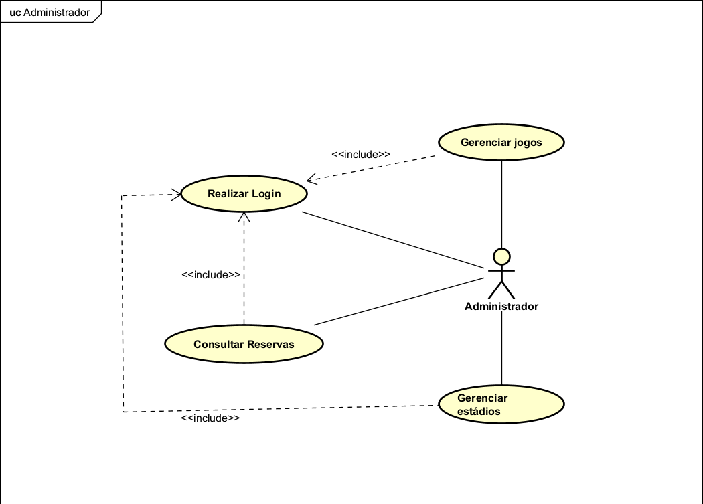
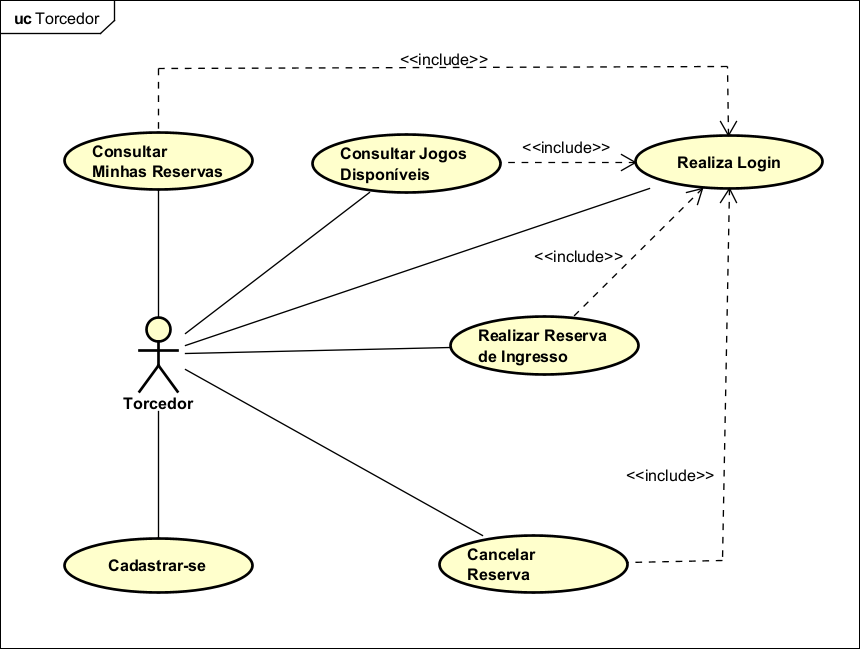

# Documento de Requisitos

## FIFA WORLD CUP BOOKING 2026
### Sistema de Venda de Ingressos
**v0.1**

---

## Ficha Técnica

**Equipe Responsável pela Elaboração**

| Nome | Divisão/Região |
|---|---|
| Maria Rita Resende | Front-End |
| Luiz Phillip Resende | Fullstack |
| Tainara de Fátima Matias Souza | Back-End |

**Público Alvo**
Este documento destina-se aos desenvolvedores e demais partes interessadas no projeto da disciplina GCC188 da Universidade Federal de Lavras.

---

## Sumário

1. [Introdução](#1-introdução)
2. [Descrição Geral do Sistema](#2-descrição-geral-do-sistema)
3. [Requisitos Funcionais (Casos de Uso)](#3-requisitos-funcionais-casos-de-uso)
4. [Requisitos Não Funcionais](#4-requisitos-não-funcionais)
5. [Descrição da Interface com o Usuário](#5-descrição-da-interface-com-o-usuário)
6. [Dicionário de Dados](#6-dicionário-de-dados)

---

## 1. Introdução

Este documento especifica o sistema **FIFA World Cup Booking**, plataforma web de venda de ingressos para a Copa do Mundo FIFA 2026. Ele fornece aos desenvolvedores as informações necessárias para o projeto e implementação, assim como para a realização dos testes e homologação do sistema.

### 1.1 Visão Geral deste Documento

Esta introdução fornece as informações necessárias para fazer bom uso deste documento, explicitando seus objetivos e as convenções adotadas, além de conter referências para outros documentos relacionados. As demais seções estão organizadas como descrito abaixo:

- **Capítulo 2** – Descrição geral do sistema: apresenta uma visão geral do sistema, caracterizando seu escopo e descrevendo seus usuários.
- **Capítulo 3** – Requisitos funcionais (casos de uso): apresenta todos os requisitos funcionais do sistema, descrevendo os fluxos de eventos, prioridades, atores, entradas e saídas de cada caso de uso.
- **Capítulo 4** – Requisitos não funcionais: apresenta todos os requisitos não funcionais do sistema, divididos em categorias (usabilidade, desempenho, segurança, etc.).
- **Capítulo 5** – Descrição da interface com o usuário: apresenta o mapa de navegação e os protótipos de tela.
- **Capítulo 6** – Dicionário de Dados: apresenta a primeira versão do dicionário de dados.

### 1.2 Glossário, Siglas e Acrônimos

| Termo | Definição |
|---|---|
| **Ingresso** | Documento digital ou físico que autoriza o acesso do torcedor a uma partida da Copa do Mundo. |
| **Reserva** | Registro temporário de um assento para um usuário, aguardando confirmação de pagamento. |
| **Assento** | Lugar físico em um estádio identificado por setor e número, vinculado a um jogo específico. |
| **Jogo** | Partida oficial da Copa do Mundo, com dois times, data, hora e estádio definidos. |
| **Estádio** | Local físico onde as partidas serão realizadas, com capacidade e localização definidas. |
| **Torcedor** | Usuário final do sistema que busca, reserva e compra ingressos. |
| **Administrador** | Funcionário responsável pelo gerenciamento da plataforma (estádios, jogos, assentos). |
| **CRUD** | Create, Read, Update, Delete – conjunto de operações básicas sobre dados. |
| **RF** | Requisito Funcional. |
| **RNF** | Requisito Não Funcional. |
| **API** | Application Programming Interface. |
| **JWT** | JSON Web Token – mecanismo de autenticação stateless. |

### 1.3 Definições e Atributos de Requisitos

#### Identificação dos Requisitos

`RF` é utilizado para identificar Requisitos Funcionais e `RNF` é utilizado para identificar Requisitos Não Funcionais. Ambas as siglas vêm acompanhadas de um número identificador único. Por exemplo, `[RF016]` indica o requisito funcional de número 16.

#### Prioridades dos Requisitos

| Prioridade | Definição |
|---|---|
| **Essencial** | Requisito sem o qual o sistema não entra em funcionamento. Deve ser implementado impreterivelmente. |
| **Importante** | Requisito sem o qual o sistema entra em funcionamento, mas de forma não satisfatória. |
| **Desejável** | Requisito que não compromete as funcionalidades básicas do sistema; pode ser deixado para versões futuras. |

---

## 2. Descrição Geral do Sistema

O **FIFA World Cup Booking** é uma plataforma web desenvolvida com Next.js para simular o processo de reserva e venda de ingressos para a Copa do Mundo FIFA 2026. O sistema permite que torcedores (clientes) visualizem os jogos disponíveis, selecionem assentos e realizem compras de ingressos de forma segura e transparente.

O sistema é composto por dois perfis de usuário: **Administrador** e **Torcedor**. O Administrador gerencia os dados da plataforma (estádios, jogos, assentos e usuários), enquanto o Torcedor utiliza o sistema para buscar jogos e adquirir ingressos. **O login é obrigatório para acessar qualquer funcionalidade do sistema.**

### 2.1 Abrangência e Sistemas Relacionados

**O sistema irá fazer:**
- Cadastro e gerenciamento de usuários (Administradores e Torcedores).
- Cadastro e gerenciamento de estádios, jogos e assentos.
- Reserva e compra de ingressos com seleção visual de assentos.
- Consulta de reservas por usuário e por jogo.
- Cancelamento de reservas.
- Autenticação via login (e-mail e senha).

**O sistema NÃO irá fazer (escopo negativo):**
- Processamento de pagamento real (simulado apenas).
- Envio de e-mails transacionais (fora do escopo desta versão).
- Integração com sistemas externos da FIFA.

O sistema é **independente e auto-contido**, sem integração com outros sistemas externos nesta versão.

### 2.2 Relação de Usuários do Sistema

Foram identificados dois perfis principais de usuários:

**Administrador**
O Administrador é o funcionário responsável pela gestão geral da plataforma. Ele possui acesso total ao sistema e é responsável pelo cadastro de estádios, gerenciamento das partidas (jogos), criação e configuração dos assentos, além do acompanhamento das reservas/vendas.

**Torcedor (Cliente)**
O Torcedor é o usuário final que utiliza o sistema para visualizar os jogos disponíveis, escolher seus assentos no mapa interativo e realizar a compra/reserva de ingressos para a Copa. O Torcedor pode consultar e cancelar suas próprias reservas.

### 2.3 Diagrama de Caso de Uso

> Os diagramas abaixo foram elaborados com a ferramenta **Astah UML** e os arquivos originais (`.asta`) estão disponíveis em `requisitos/DiagramaCasosDeUso.asta`.

#### Visão do Administrador





#### Visão do Torcedor





## 3. Requisitos Funcionais (Casos de Uso)

Nesta seção são apresentados todos os requisitos funcionais do sistema, agrupados por entidade/módulo.

---

### ████████████████  AUTENTICAÇÃO  ████████████████

#### [RF001] Realizar Login

| RF 001 | Realizar Login |  |
|:---|:---|:---|
| **Prioridade:** | (✅) Essencial &nbsp;&nbsp; ( ) Importante &nbsp;&nbsp; ( ) Desejável | |
| **Atores:** | Administrador, Torcedor | |
| **Resumo:** | O usuário acessa o sistema informando seu e-mail e senha. O login é obrigatório para comprar ingressos e acessar funcionalidades pessoais. A visualização da lista de jogos disponíveis é pública (não requer login). | |
| **Pré-condição:** | O usuário deve possuir cadastro ativo no sistema. O usuário deve estar na tela **I_Login**. | |
| **Pós-condição:** | O sistema autentica o usuário, gera um token de sessão (JWT) e redireciona para o painel correspondente ao seu perfil (Administrador ou Torcedor). | |
| **Interfaces:** | I_Login, IE_Login_CredenciaisInvalidas, IS_Login_Sucesso | |
| **Fluxo principal:** | Usuário: 1. Acessa a página de login. 3. Informa e-mail e senha. 5. Clica em "Entrar". | Sistema: 2. Exibe o formulário de login. 4. Valida o formato do e-mail. 6. Verifica as credenciais no banco de dados. 7. Gera token JWT e redireciona para o painel do usuário. |
| **Fluxo alternativo:** | Usuário: — | Sistema: 6a. Caso as credenciais sejam inválidas, exibe a mensagem "E-mail ou senha incorretos" e mantém o usuário na tela de login. |
| **Regras de Negócio:** | RN01 – A senha é armazenada como hash (bcrypt) e nunca em texto puro. RN02 – Após 5 tentativas consecutivas de login falhas, a conta é bloqueada por 15 minutos. | |

---

### ████████████████  ESTÁDIO  ████████████████

> **Agrupamento:** Os requisitos RF002 a RF005 correspondem ao CRUD completo da entidade **Estádio** (operações sobre uma única tabela: `estadios`). Todos os casos de uso deste grupo têm o **Administrador** como ator.

#### [RF002] Cadastrar Estádio

| RF 002 | Cadastrar Estádio |  |
|:---|:---|:---|
| **Prioridade:** | (✅) Essencial &nbsp;&nbsp; ( ) Importante &nbsp;&nbsp; ( ) Desejável | |
| **Atores:** | Administrador | |
| **Resumo:** | O Administrador cadastra um novo estádio no sistema, informando nome, cidade e capacidade total. | |
| **Pré-condição:** | O Administrador deve estar autenticado (RF001) e estar na tela **I_DashboardAdmin**. | |
| **Pós-condição:** | O novo estádio é persistido na tabela `estadios` do banco de dados e passa a estar disponível para vínculo com jogos. | |
| **Interfaces:** | I_CadastrarEstadio, IS_CadastrarEstadio_Sucesso, IE_CadastrarEstadio_DadosInvalidos | |
| **Fluxo principal:** | Administrador: 1. Acessa o menu "Estádios" > "Novo Estádio". 3. Preenche nome, cidade e capacidade. 5. Clica em "Salvar". | Sistema: 2. Exibe o formulário de cadastro. 4. Valida os campos obrigatórios. 6. Persiste o estádio no banco. 7. Exibe mensagem de sucesso e lista os estádios cadastrados. |
| **Fluxo alternativo:** | Administrador: — | Sistema: 4a. Se algum campo obrigatório estiver vazio, exibe mensagem de erro indicando o campo faltante. 4b. Se a capacidade informada não for um número inteiro positivo, exibe mensagem de erro. |
| **Regras de Negócio:** | RN03 – A capacidade do estádio deve ser um número inteiro maior que zero. RN04 – Não podem existir dois estádios com o mesmo nome e cidade simultaneamente. | |

#### [RF003] Consultar Estádios

| RF 003 | Consultar Estádios |  |
|:---|:---|:---|
| **Prioridade:** | (✅) Essencial &nbsp;&nbsp; ( ) Importante &nbsp;&nbsp; ( ) Desejável | |
| **Atores:** | Administrador | |
| **Resumo:** | O Administrador visualiza a lista de todos os estádios cadastrados no sistema, podendo filtrar por nome ou cidade. | |
| **Pré-condição:** | O Administrador deve estar autenticado (RF001) e estar na tela **I_DashboardAdmin**. Deve existir ao menos um estádio cadastrado. | |
| **Pós-condição:** | O sistema exibe a lista de estádios conforme os filtros aplicados. Nenhum dado é alterado. | |
| **Interfaces:** | I_ConsultarEstadios | |
| **Fluxo principal:** | Administrador: 1. Acessa o menu "Estádios". 3. (Opcional) Informa filtros de nome ou cidade. 5. Clica em "Buscar". | Sistema: 2. Exibe a lista completa de estádios cadastrados. 4. Aguarda a aplicação de filtros. 6. Exibe os estádios correspondentes ao filtro. |
| **Fluxo alternativo:** | Administrador: — | Sistema: 6a. Se nenhum estádio for encontrado com os filtros aplicados, exibe a mensagem "Nenhum estádio encontrado para os filtros informados". |
| **Regras de Negócio:** | RN05 – A consulta sem filtros deve retornar todos os estádios em ordem alfabética por nome. | |

#### [RF004] Alterar Estádio

| RF 004 | Alterar Estádio |  |
|:---|:---|:---|
| **Prioridade:** | ( ) Essencial &nbsp;&nbsp; (✅) Importante &nbsp;&nbsp; ( ) Desejável | |
| **Atores:** | Administrador | |
| **Resumo:** | O Administrador edita as informações de um estádio já cadastrado (nome, cidade ou capacidade). | |
| **Pré-condição:** | O Administrador deve estar autenticado (RF001) e estar na tela **I_ConsultarEstadios**. O estádio a ser editado deve existir no sistema. | |
| **Pós-condição:** | Os dados do estádio são atualizados na tabela `estadios` do banco de dados. | |
| **Interfaces:** | I_AlterarEstadio, IS_AlterarEstadio_Sucesso, IE_AlterarEstadio_DadosInvalidos | |
| **Fluxo principal:** | Administrador: 1. Acessa a lista de estádios (RF003). 3. Clica em "Editar" no estádio desejado. 5. Altera os campos desejados. 7. Clica em "Salvar". | Sistema: 2. — 4. Exibe o formulário de edição preenchido com os dados atuais. 6. Valida os campos. 8. Atualiza os dados no banco e exibe mensagem de sucesso. |
| **Fluxo alternativo:** | Administrador: — | Sistema: 6a. Se algum campo obrigatório for deixado em branco, exibe mensagem de erro. 6b. Se a capacidade informada for inválida, exibe mensagem de erro. |
| **Regras de Negócio:** | RN06 – Se o estádio possuir jogos cadastrados, a redução de capacidade não pode ser menor que o número de assentos já criados para aquele estádio. | |

#### [RF005] Excluir Estádio

| RF 005 | Excluir Estádio |  |
|:---|:---|:---|
| **Prioridade:** | ( ) Essencial &nbsp;&nbsp; (✅) Importante &nbsp;&nbsp; ( ) Desejável | |
| **Atores:** | Administrador | |
| **Resumo:** | O Administrador remove um estádio do sistema, desde que ele não possua jogos vinculados. | |
| **Pré-condição:** | O Administrador deve estar autenticado (RF001) e estar na tela **I_ConsultarEstadios**. O estádio a ser excluído deve existir e não possuir jogos vinculados. | |
| **Pós-condição:** | O estádio é removido da tabela `estadios` do banco de dados. | |
| **Interfaces:** | I_ConsultarEstadios, IE_ExcluirEstadio_PossuiJogos, IS_ExcluirEstadio_Sucesso | |
| **Fluxo principal:** | Administrador: 1. Acessa a lista de estádios (RF003). 3. Clica em "Excluir" no estádio desejado. 5. Confirma a exclusão. | Sistema: 2. — 4. Exibe caixa de diálogo de confirmação. 6. Remove o estádio do banco de dados e exibe mensagem de sucesso. |
| **Fluxo alternativo:** | Administrador: — | Sistema: 6a. Se o estádio possuir jogos vinculados, exibe a mensagem "Este estádio não pode ser excluído pois possui jogos cadastrados. Remova os jogos primeiro." e cancela a operação. 5a. Se o Administrador cancelar a confirmação, nenhuma ação é executada. |
| **Regras de Negócio:** | RN07 – A exclusão de estádio com jogos vinculados é bloqueada para preservar a integridade referencial do banco de dados. | |

---

### ████████████████  JOGO  ████████████████

> **Agrupamento:** Os requisitos RF006 a RF009 correspondem ao CRUD completo da entidade **Jogo** (tabela `jogos` com referência à tabela `estadios`). O ator principal é o **Administrador**.

#### [RF006] Cadastrar Jogo

| RF 006 | Cadastrar Jogo |  |
|:---|:---|:---|
| **Prioridade:** | (✅) Essencial &nbsp;&nbsp; ( ) Importante &nbsp;&nbsp; ( ) Desejável | |
| **Atores:** | Administrador | |
| **Resumo:** | O Administrador cadastra uma nova partida no sistema, informando os times, a data/hora e o estádio onde será realizada. | |
| **Pré-condição:** | O Administrador deve estar autenticado (RF001) e estar na tela **I_DashboardAdmin**. Deve existir ao menos um estádio cadastrado (RF002). | |
| **Pós-condição:** | O jogo é persistido na tabela `jogos` vinculado ao estádio selecionado. O sistema cria automaticamente os assentos disponíveis para o jogo com base na capacidade do estádio. | |
| **Interfaces:** | I_CadastrarJogo, IS_CadastrarJogo_Sucesso, IE_CadastrarJogo_DadosInvalidos | |
| **Fluxo principal:** | Administrador: 1. Acessa o menu "Jogos" > "Novo Jogo". 3. Preenche time da casa, time visitante, data/hora e seleciona o estádio. 5. Define o preço dos assentos por setor. 7. Clica em "Salvar". | Sistema: 2. Exibe o formulário de cadastro com a lista de estádios disponíveis. 4. Valida os campos obrigatórios. 6. Valida os preços informados. 8. Persiste o jogo e gera os assentos automaticamente. 9. Exibe mensagem de sucesso. |
| **Fluxo alternativo:** | Administrador: — | Sistema: 4a. Se algum campo estiver vazio, exibe mensagem de erro. 4b. Se a data informada for anterior à data atual, exibe "A data do jogo deve ser futura". |
| **Regras de Negócio:** | RN08 – Não podem ser cadastrados dois jogos no mesmo estádio no mesmo dia e horário. RN09 – O preço de cada assento deve ser maior que R$ 0,00. | |

#### [RF007] Consultar Jogos

| RF 007 | Consultar Jogos |  |
|:---|:---|:---|
| **Prioridade:** | (✅) Essencial &nbsp;&nbsp; ( ) Importante &nbsp;&nbsp; ( ) Desejável | |
| **Atores:** | Administrador | |
| **Resumo:** | O Administrador visualiza todos os jogos cadastrados no sistema, podendo filtrar por data, times ou estádio. | |
| **Pré-condição:** | O Administrador deve estar autenticado (RF001) e estar na tela **I_DashboardAdmin**. | |
| **Pós-condição:** | O sistema exibe a lista de jogos conforme os filtros aplicados. Nenhum dado é alterado. | |
| **Interfaces:** | I_ConsultarJogos | |
| **Fluxo principal:** | Administrador: 1. Acessa o menu "Jogos". 3. (Opcional) Aplica filtros. 5. Clica em "Buscar". | Sistema: 2. Exibe todos os jogos cadastrados em ordem cronológica. 4. Aguarda filtros. 6. Exibe os jogos filtrados. |
| **Fluxo alternativo:** | Administrador: — | Sistema: 6a. Se nenhum jogo for encontrado, exibe "Nenhum jogo encontrado". |
| **Regras de Negócio:** | RN10 – A consulta exibe também o nome do estádio vinculado a cada jogo. | |

#### [RF008] Alterar Jogo

| RF 008 | Alterar Jogo |  |
|:---|:---|:---|
| **Prioridade:** | ( ) Essencial &nbsp;&nbsp; (✅) Importante &nbsp;&nbsp; ( ) Desejável | |
| **Atores:** | Administrador | |
| **Resumo:** | O Administrador edita as informações de um jogo já cadastrado (times, data/hora, estádio). | |
| **Pré-condição:** | O Administrador deve estar autenticado (RF001) e estar na tela **I_ConsultarJogos**. O jogo a ser editado deve existir e não ter reservas confirmadas vinculadas. | |
| **Pós-condição:** | Os dados do jogo são atualizados na tabela `jogos`. | |
| **Interfaces:** | I_AlterarJogo, IS_AlterarJogo_Sucesso, IE_AlterarJogo_PossuiReservas | |
| **Fluxo principal:** | Administrador: 1. Acessa a lista de jogos (RF007). 3. Clica em "Editar". 5. Altera os campos desejados. 7. Clica em "Salvar". | Sistema: 2. — 4. Exibe formulário preenchido com dados atuais. 6. Valida os dados. 8. Atualiza os dados e exibe mensagem de sucesso. |
| **Fluxo alternativo:** | Administrador: — | Sistema: 6a. Se houver reservas confirmadas para o jogo, exibe "Este jogo possui reservas confirmadas e não pode ser editado sem cancelá-las primeiro." |
| **Regras de Negócio:** | RN11 – Alteração de estádio em um jogo com reservas pendentes exige confirmação explícita do administrador. | |

#### [RF009] Excluir Jogo

| RF 009 | Excluir Jogo |  |
|:---|:---|:---|
| **Prioridade:** | ( ) Essencial &nbsp;&nbsp; (✅) Importante &nbsp;&nbsp; ( ) Desejável | |
| **Atores:** | Administrador | |
| **Resumo:** | O Administrador remove um jogo do sistema, desde que não haja reservas confirmadas para ele. | |
| **Pré-condição:** | O Administrador deve estar autenticado (RF001) e estar na tela **I_ConsultarJogos**. O jogo deve existir e não possuir reservas confirmadas. | |
| **Pós-condição:** | O jogo é removido da tabela `jogos`. Os assentos e reservas pendentes vinculados são também removidos. | |
| **Interfaces:** | I_ConsultarJogos, IE_ExcluirJogo_PossuiReservas, IS_ExcluirJogo_Sucesso | |
| **Fluxo principal:** | Administrador: 1. Acessa a lista de jogos (RF007). 3. Clica em "Excluir". 5. Confirma a exclusão. | Sistema: 2. — 4. Exibe caixa de confirmação. 6. Remove o jogo e seus assentos do banco. Exibe mensagem de sucesso. |
| **Fluxo alternativo:** | Administrador: — | Sistema: 6a. Se houver reservas confirmadas, exibe "Este jogo possui reservas confirmadas e não pode ser excluído. Cancele as reservas primeiro." |
| **Regras de Negócio:** | RN12 – A exclusão de um jogo remove em cascata os assentos e reservas pendentes associados. | |

---

### ████████████████  RESERVA (CRUD com 3+ TABELAS)  ████████████████

> **Agrupamento:** Os requisitos RF010 a RF015 envolvem operações sobre múltiplas tabelas simultaneamente: `reservas`, `usuarios`, `jogos` e `assentos`. Cada operação de reserva exige a leitura e atualização coordenada dessas entidades.

#### [RF010] Consultar Reservas (Administrador)

| RF 010 | Consultar Reservas |  |
|:---|:---|:---|
| **Prioridade:** | ( ) Essencial &nbsp;&nbsp; (✅) Importante &nbsp;&nbsp; ( ) Desejável | |
| **Atores:** | Administrador | |
| **Resumo:** | O Administrador visualiza todas as reservas do sistema, consolidando dados de usuários, jogos e assentos. Pode filtrar por jogo, usuário ou status da reserva. | |
| **Tabelas envolvidas:** | `reservas`, `usuarios`, `jogos`, `assentos` | |
| **Pré-condição:** | O Administrador deve estar autenticado (RF001) e estar na tela **I_DashboardAdmin**. | |
| **Pós-condição:** | O sistema exibe a lista de reservas consolidada. Nenhum dado é alterado. | |
| **Interfaces:** | I_ConsultarReservas_Admin | |
| **Fluxo principal:** | Administrador: 1. Acessa o menu "Reservas". 3. (Opcional) Aplica filtros por jogo, usuário ou status. 5. Clica em "Buscar". | Sistema: 2. Exibe todas as reservas com nome do usuário, jogo, assento e status. 4. Aguarda filtros. 6. Exibe reservas filtradas. |
| **Fluxo alternativo:** | Administrador: — | Sistema: 6a. Se nenhuma reserva for encontrada com os filtros, exibe "Nenhuma reserva encontrada". |
| **Regras de Negócio:** | RN13 – O relatório de reservas exibe os dados consolidados de 4 tabelas: nome do usuário (`usuarios`), nome do jogo com times e data (`jogos`), setor e número do assento (`assentos`) e status da reserva (`reservas`). | |

#### [RF011] Cadastrar Usuário (Auto-Cadastro do Torcedor)

| RF 011 | Cadastrar Usuário |  |
|:---|:---|:---|
| **Prioridade:** | (✅) Essencial &nbsp;&nbsp; ( ) Importante &nbsp;&nbsp; ( ) Desejável | |
| **Atores:** | Torcedor (não autenticado) | |
| **Resumo:** | Um visitante (não cadastrado) cria uma conta de Torcedor no sistema, informando nome completo, e-mail e senha. Após o cadastro, poderá realizar o login (RF001). | |
| **Tabelas envolvidas:** | `usuarios` | |
| **Pré-condição:** | O usuário deve estar na tela **I_CadastrarUsuario** (acessível a partir de I_Login). O e-mail informado não pode estar já cadastrado no sistema. | |
| **Pós-condição:** | O usuário é persistido na tabela `usuarios` com a senha armazenada como hash. O usuário é redirecionado para a tela de login. | |
| **Interfaces:** | I_CadastrarUsuario, IS_CadastrarUsuario_Sucesso, IE_CadastrarUsuario_EmailJaCadastrado | |
| **Fluxo principal:** | Torcedor: 1. Acessa a página inicial e clica em "Criar Conta". 3. Preenche nome, e-mail e senha. 5. Clica em "Cadastrar". | Sistema: 2. Exibe o formulário de cadastro. 4. Valida os campos (formato de e-mail, tamanho de senha). 6. Verifica se e-mail já existe. 7. Salva o usuário com senha hasheada. 8. Redireciona para o login com mensagem de sucesso. |
| **Fluxo alternativo:** | Torcedor: — | Sistema: 6a. Se o e-mail já estiver cadastrado, exibe "Este e-mail já está em uso. Tente fazer login." 4a. Se a senha tiver menos de 8 caracteres, exibe "A senha deve ter no mínimo 8 caracteres." |
| **Regras de Negócio:** | RN14 – A senha do usuário deve ter no mínimo 8 caracteres. RN15 – O e-mail deve ser único no sistema. | |

#### [RF012] Realizar Reserva de Ingresso

| RF 012 | Realizar Reserva de Ingresso |  |
|:---|:---|:---|
| **Prioridade:** | (✅) Essencial &nbsp;&nbsp; ( ) Importante &nbsp;&nbsp; ( ) Desejável | |
| **Atores:** | Torcedor | |
| **Resumo:** | O Torcedor autenticado seleciona um jogo disponível, escolhe um assento livre no mapa interativo e confirma a reserva do ingresso. O sistema atualiza o status do assento e cria o registro de reserva. | |
| **Tabelas envolvidas:** | `reservas`, `usuarios`, `jogos`, `assentos` | |
| **Pré-condição:** | O Torcedor deve estar autenticado (RF001) e estar na tela **I_ListaJogos** ou **I_DashboardTorcedor**. O jogo deve estar disponível e a data do jogo deve ser futura. O assento selecionado deve estar com status `disponivel`. | |
| **Pós-condição:** | Um registro é criado na tabela `reservas` com status `pendente`. O status do assento na tabela `assentos` é alterado para `reservado`. | |
| **Interfaces:** | I_ConsultarJogosDisponiveis, I_MapaAssentos, I_ConfirmarReserva, IS_RealizarReserva_Sucesso, IE_RealizarReserva_AssentoIndisponivel | |
| **Fluxo principal:** | Torcedor: 1. Acessa "Jogos Disponíveis" (RF015). 3. Seleciona um jogo. 5. Seleciona um assento disponível no mapa. 7. Confirma a reserva. | Sistema: 2. — 4. Exibe o mapa interativo de assentos do jogo, destacando disponíveis, reservados e vendidos. 6. Exibe o resumo da reserva (jogo, assento, preço). 8. Cria o registro de reserva. Atualiza o status do assento para `reservado`. Exibe confirmação. |
| **Fluxo alternativo:** | Torcedor: — | Sistema: 6a. Se o assento selecionado for ocupado por outro usuário simultaneamente, exibe "Este assento acabou de ser reservado. Por favor, selecione outro." e recarrega o mapa. |
| **Regras de Negócio:** | RN16 – Um Torcedor não pode reservar mais de 4 assentos para o mesmo jogo. RN17 – A reserva tem validade de 30 minutos; se não confirmada (pagamento simulado), o assento retorna para `disponivel` automaticamente. | |

#### [RF013] Consultar Minhas Reservas

| RF 013 | Consultar Minhas Reservas |  |
|:---|:---|:---|
| **Prioridade:** | (✅) Essencial &nbsp;&nbsp; ( ) Importante &nbsp;&nbsp; ( ) Desejável | |
| **Atores:** | Torcedor | |
| **Resumo:** | O Torcedor autenticado visualiza todas as suas reservas (pendentes, confirmadas e canceladas), com detalhes do jogo, assento e preço pago. | |
| **Tabelas envolvidas:** | `reservas`, `jogos`, `assentos` | |
| **Pré-condição:** | O Torcedor deve estar autenticado (RF001) e estar na tela **I_DashboardTorcedor**. | |
| **Pós-condição:** | O sistema exibe a lista de reservas do usuário logado. Nenhum dado é alterado. | |
| **Interfaces:** | I_MinhasReservas | |
| **Fluxo principal:** | Torcedor: 1. Acessa o menu "Minhas Reservas". | Sistema: 2. Consulta todas as reservas vinculadas ao `usuario_id` do usuário logado. 3. Exibe a lista com nome do jogo, data, estádio, setor, número do assento e status. |
| **Fluxo alternativo:** | Torcedor: — | Sistema: 3a. Se o usuário não possuir reservas, exibe "Você ainda não possui reservas. Que tal comprar ingressos para um jogo?" |
| **Regras de Negócio:** | RN18 – O Torcedor visualiza apenas suas próprias reservas, nunca as de outros usuários. | |

#### [RF014] Cancelar Reserva

| RF 014 | Cancelar Reserva |  |
|:---|:---|:---|
| **Prioridade:** | ( ) Essencial &nbsp;&nbsp; (✅) Importante &nbsp;&nbsp; ( ) Desejável | |
| **Atores:** | Torcedor | |
| **Resumo:** | O Torcedor cancela uma reserva pendente ou confirmada. O sistema atualiza o status da reserva e libera o assento para outros torcedores. | |
| **Tabelas envolvidas:** | `reservas`, `assentos`, `jogos` | |
| **Pré-condição:** | O Torcedor deve estar autenticado (RF001) e estar na tela **I_MinhasReservas**. A reserva deve estar no status `pendente` ou `confirmado`. A data do jogo deve ser, no mínimo, 48 horas à frente da data atual. | |
| **Pós-condição:** | O status da reserva é alterado para `cancelado` na tabela `reservas`. O status do assento é alterado de volta para `disponivel` na tabela `assentos`. | |
| **Interfaces:** | I_MinhasReservas, IE_CancelarReserva_PrazoExpirado, IS_CancelarReserva_Sucesso | |
| **Fluxo principal:** | Torcedor: 1. Acessa "Minhas Reservas" (RF013). 3. Clica em "Cancelar" na reserva desejada. 5. Confirma o cancelamento. | Sistema: 2. — 4. Exibe caixa de confirmação com aviso de que a ação não pode ser desfeita. 6. Atualiza o status da reserva para `cancelado`. 7. Libera o assento. 8. Exibe mensagem de sucesso. |
| **Fluxo alternativo:** | Torcedor: — | Sistema: 6a. Se o jogo ocorrer em menos de 48 horas, exibe "Não é possível cancelar reservas com menos de 48 horas de antecedência do jogo." |
| **Regras de Negócio:** | RN19 – O cancelamento de reserva só é permitido com no mínimo 48 horas de antecedência em relação à data do jogo. | |

#### [RF015] Consultar Jogos Disponíveis

| RF 015 | Consultar Jogos Disponíveis |  |
|:---|:---|:---|
| **Prioridade:** | (✅) Essencial &nbsp;&nbsp; ( ) Importante &nbsp;&nbsp; ( ) Desejável | |
| **Atores:** | Visitante (não autenticado), Torcedor | |
| **Resumo:** | Qualquer usuário (mesmo sem estar autenticado) pode visualizar a lista de jogos futuros com ingressos à venda, com informações sobre times, data, estádio e disponibilidade de assentos. Para **comprar** um ingresso, o usuário deve estar autenticado (RF001). | |
| **Tabelas envolvidas:** | `jogos`, `estadios`, `assentos` | |
| **Pré-condição:** | O usuário deve estar na tela **I_ListaJogos** (página inicial pública do sistema). Não é necessário estar autenticado para visualizar os jogos. | |
| **Pós-condição:** | O sistema exibe os jogos futuros com assentos disponíveis. Nenhum dado é alterado. | |
| **Interfaces:** | I_ListaJogos | |
| **Fluxo principal:** | Visitante/Torcedor: 1. Acessa a página inicial do sistema (sem necessidade de login). 3. (Opcional) Aplica filtros por data, time ou cidade. 5. Clica em "Ver Ingressos" em um jogo. | Sistema: 2. Exibe a lista de jogos futuros com assentos disponíveis, mostrando times, data, estádio, cidade e quantidade de assentos disponíveis. 4. Filtra e atualiza a lista. 6a. Se o usuário **não estiver autenticado**: exibe a tela de login (I_Login) antes de prosseguir para a seleção de assentos. 6b. Se o usuário **já estiver autenticado**: exibe diretamente o mapa de assentos (I_MapaAssentos). |
| **Fluxo alternativo:** | Visitante/Torcedor: — | Sistema: 2a. Se não houver jogos futuros com assentos disponíveis, exibe "No momento não há jogos disponíveis para compra de ingressos." |
| **Regras de Negócio:** | RN20 – Apenas jogos com data futura e com pelo menos 1 assento com status `disponivel` são exibidos nesta listagem. RN21 – A visualização da lista de jogos é pública; apenas a compra (RF012) exige autenticação. | |

---

## 4. Requisitos Não Funcionais

Esta seção contém os requisitos não funcionais do sistema FIFA World Cup Booking, organizados por categoria.

---

### 4.1 Usabilidade

Esta seção descreve os requisitos não funcionais associados à facilidade de uso da interface com o usuário.

#### [RNF001] Tempo de Aprendizado da Interface Principal

O sistema deve ser projetado de forma que um usuário que nunca o utilizou anteriormente seja capaz de localizar a lista de jogos disponíveis e iniciar o processo de compra de um ingresso em no máximo **3 cliques** a partir da tela de login, sem necessidade de leitura de manual ou tutorial.

| Prioridade: | ◻ | Essencial | 🗹 | Importante | ◻ | Desejável |
|:---|---:|:---|---:|:---|---:|:---|

#### [RNF002] Compatibilidade com Navegadores Web

O sistema deve funcionar corretamente (sem erros de layout, funcionalidades quebradas ou falhas de JavaScript) nas seguintes versões mínimas de navegadores:
- Google Chrome versão 110 ou superior.
- Mozilla Firefox versão 110 ou superior.
- Microsoft Edge versão 110 ou superior.
- Safari versão 16 ou superior (macOS e iOS).

| Prioridade: | ◻ | Essencial | 🗹 | Importante | ◻ | Desejável |
|:---|---:|:---|---:|:---|---:|:---|

---

### 4.2 Desempenho

Esta seção descreve os requisitos não funcionais associados à eficiência, uso de recursos e tempo de resposta do sistema.

#### [RNF003] Tempo de Resposta das Páginas

Todas as páginas do sistema devem ser carregadas e renderizadas completamente em no máximo **3 segundos** em uma conexão de internet com largura de banda de 10 Mbps, medido a partir do momento em que o usuário aciona a navegação até a exibição completa do conteúdo (estado "Carregamento Concluído" do navegador).

| Prioridade: | 🗹 | Essencial | ◻ | Importante | ◻ | Desejável |
|:---|---:|:---|---:|:---|---:|:---|

#### [RNF004] Capacidade de Usuários Simultâneos

O sistema deve suportar no mínimo **500 usuários realizando operações simultâneas** (consulta de jogos, seleção de assentos e criação de reservas) sem degradação de desempenho — ou seja, sem que o tempo de resposta das páginas ultrapasse o limite definido em NF003. Este requisito deve ser validado por meio de testes de carga com a ferramenta Apache JMeter versão 5.6 ou superior.

| Prioridade: | ◻ | Essencial | 🗹 | Importante | ◻ | Desejável |
|:---|---:|:---|---:|:---|---:|:---|

---

### 4.3 Segurança

Esta seção descreve os requisitos não funcionais associados à integridade, privacidade e autenticidade dos dados.

#### [RNF005] Criptografia de Senhas no Banco de Dados

Todas as senhas de usuários devem ser armazenadas no banco de dados PostgreSQL utilizando o algoritmo de hash **bcrypt** com fator de custo (cost factor) mínimo de **12**, de forma que nenhuma senha seja armazenada em texto plano. Este requisito se aplica tanto ao cadastro quanto à alteração de senha. A implementação deve utilizar a biblioteca `bcryptjs` versão 2.4.3 ou superior.

| Prioridade: | 🗹 | Essencial | ◻ | Importante | ◻ | Desejável |
|:---|---:|:---|---:|:---|---:|:---|

#### [RNF006] Autenticação por Token JWT

O controle de acesso ao sistema deve ser implementado por meio de **JSON Web Tokens (JWT)** com prazo de expiração máximo de **8 horas** a partir do momento do login. Após a expiração, o usuário deve ser redirecionado automaticamente para a tela de login. Os tokens devem ser assinados com o algoritmo **HS256** utilizando uma chave secreta de no mínimo 32 caracteres configurada via variável de ambiente.

| Prioridade: | 🗹 | Essencial | ◻ | Importante | ◻ | Desejável |
|:---|---:|:---|---:|:---|---:|:---|

---

### 4.4 Confiabilidade

Esta seção descreve os requisitos não funcionais associados à frequência e severidade de falhas e à capacidade de recuperação do sistema.

#### [RNF007] Disponibilidade do Sistema

O sistema deve estar disponível para acesso dos usuários em no mínimo **99% do tempo** em um período mensal, excluindo janelas de manutenção programadas (previamente comunicadas com no mínimo 24 horas de antecedência). Isso equivale a no máximo **7 horas e 12 minutos** de indisponibilidade não planejada por mês.

| Prioridade: | ◻ | Essencial | 🗹 | Importante | ◻ | Desejável |
|:---|---:|:---|---:|:---|---:|:---|

---

### 4.5 Distribuição

Esta seção descreve os requisitos não funcionais associados à distribuição e execução do sistema.

#### [RNF008] Compatibilidade com Sistema Operacional do Servidor

O sistema deve ser executável em servidores com sistema operacional **Linux Ubuntu Server 22.04 LTS** ou superior, utilizando **Node.js versão 18.x ou superior** e banco de dados **PostgreSQL versão 15.x ou superior**. O sistema deve ser executável também em ambiente Windows 10 ou superior para fins de desenvolvimento local.

| Prioridade: | 🗹 | Essencial | ◻ | Importante | ◻ | Desejável |
|:---|---:|:---|---:|:---|---:|:---|

---

## 5. Descrição da Interface com o Usuário

Neste documento, adota-se a seguinte nomenclatura:
- `I_` para identificar uma interface normal.
- `IE_` para identificar uma interface com mensagem de **erro**.
- `IS_` para identificar uma interface com mensagem de **sucesso**.

### 5.1 Prototipação

O protótipo de alta fidelidade contendo as interfaces descritas abaixo está documentado no arquivo em formato PDF, anexo a este repositório.

> 📄 **Documento de Prototipação**: [`requisitos/Protótipo de Engenharia de Software.pdf`](./Protótipo%20de%20Engenharia%20de%20Software.pdf)

### 5.2 Mapa de Navegação de Interfaces

O mapa abaixo representa o fluxo de navegação entre as interfaces do sistema:

```
[I_CadastrarUsuario] --> [I_Login]
                              |
              +---------------+------------------+
              |                                  |
     [Administrador]                        [Torcedor]
              |                                  |
     [I_DashboardAdmin]              [I_DashboardTorcedor]
              |                                  |
    +---------+----------+         +-------------+-----------+
    |          |          |         |             |           |
[I_CadastrarEstadio] [I_CadastrarJogo] [I_ConsultarJogosDisponiveis] [I_ConsultarReservas_Admin]
    |          |          |              |
[I_ConsultarEstadios] [I_ConsultarJogos] [I_MapaAssentos]
    |          |                          |
[I_AlterarEstadio] [I_AlterarJogo]   [I_ConfirmarReserva]
                                          |
                                    [I_MinhasReservas]
```

### 5.3 Descrição das Interfaces e Protótipos

As interfaces abaixo possuem seus protótipos visuais documentados no arquivo `Protótipo de Engenharia de Software.pdf`.

---

#### I_CadastrarUsuario – Cadastrar Usuário
**Requisitos atendidos:** RF011

---

#### I_Login – Tela de Login
**Requisitos atendidos:** RF001

---

#### IE_Login_CredenciaisInvalidas – Erro de Credenciais no Login
**Requisitos atendidos:** RF001

---

#### I_DashboardAdmin – Painel do Administrador
**Requisitos atendidos:** RF001 (após login bem-sucedido como Administrador)

---

#### I_CadastrarEstadio – Formulário de Cadastro de Estádio
**Requisitos atendidos:** RF002

---

#### I_ConsultarEstadios – Lista de Estádios
**Requisitos atendidos:** RF003, RF004, RF005

---

#### I_AlterarEstadio – Formulário de Edição de Estádio
**Requisitos atendidos:** RF004

---

#### I_CadastrarJogo – Formulário de Cadastro de Jogo
**Requisitos atendidos:** RF006

---

#### I_ConsultarJogos – Lista de Jogos (Administrador)
**Requisitos atendidos:** RF007, RF008, RF009

---

#### I_ConsultarReservas_Admin – Lista de Reservas (Administrador)
**Requisitos atendidos:** RF010

---

#### I_DashboardTorcedor – Painel do Torcedor
**Requisitos atendidos:** RF001 (após login bem-sucedido como Torcedor)

---

#### I_ListaJogos – Lista de Jogos Disponíveis (Pública — sem login)
**Requisitos atendidos:** RF015
**Acesso:** Público — não requer autenticação

---

#### I_MapaAssentos – Mapa Interativo de Assentos
**Requisitos atendidos:** RF012

---

#### I_ConfirmarReserva – Tela de Confirmação da Reserva
**Requisitos atendidos:** RF012

---

#### I_MinhasReservas – Lista de Reservas do Torcedor
**Requisitos atendidos:** RF013, RF014

---

### 5.4 Tabela de Rastreabilidade Interface ↔ Requisito

| Identificador | Nome da Interface | Requisito(s) Atendido(s) | Autenticação |
|---|---|---|---|
| **I_ListaJogos** | **Lista de Jogos Disponíveis (Página Inicial)** | **RF015** | **Público (sem login)** |
| I_CadastrarUsuario | Cadastrar Usuário | RF011 | Público (sem login) |
| I_Login | Tela de Login | RF001 | Público (sem login) |
| IE_Login_CredenciaisInvalidas | Erro de Credenciais no Login | RF001 | Público (sem login) |
| IS_Login_Sucesso | Login Realizado com Sucesso | RF001 | — |
| I_DashboardAdmin | Painel do Administrador | RF001 | Requer login (Administrador) |
| I_CadastrarEstadio | Formulário de Cadastro de Estádio | RF002 | Requer login (Administrador) |
| IS_CadastrarEstadio_Sucesso | Estádio Cadastrado com Sucesso | RF002 | Requer login |
| IE_CadastrarEstadio_DadosInvalidos | Erro no Cadastro de Estádio | RF002 | Requer login |
| I_ConsultarEstadios | Lista de Estádios | RF003, RF004, RF005 | Requer login (Administrador) |
| I_AlterarEstadio | Formulário de Edição de Estádio | RF004 | Requer login (Administrador) |
| IS_AlterarEstadio_Sucesso | Estádio Alterado com Sucesso | RF004 | Requer login |
| IE_ExcluirEstadio_PossuiJogos | Erro ao Excluir Estádio com Jogos | RF005 | Requer login |
| I_CadastrarJogo | Formulário de Cadastro de Jogo | RF006 | Requer login (Administrador) |
| I_ConsultarJogos | Lista de Jogos (Admin) | RF007, RF008, RF009 | Requer login (Administrador) |
| I_AlterarJogo | Formulário de Edição de Jogo | RF008 | Requer login (Administrador) |
| I_ConsultarReservas_Admin | Lista de Reservas (Admin) | RF010 | Requer login (Administrador) |
| I_DashboardTorcedor | Painel do Torcedor | RF001 | Requer login (Torcedor) |
| I_MapaAssentos | Mapa Interativo de Assentos | RF012 | Requer login (Torcedor) |
| I_ConfirmarReserva | Tela de Confirmação da Reserva | RF012 | Requer login (Torcedor) |
| IS_RealizarReserva_Sucesso | Reserva Realizada com Sucesso | RF012 | Requer login |
| IE_RealizarReserva_AssentoIndisponivel | Assento Indisponível | RF012 | Requer login |
| I_MinhasReservas | Lista de Reservas do Torcedor | RF013, RF014 | Requer login (Torcedor) |
| IS_CancelarReserva_Sucesso | Reserva Cancelada com Sucesso | RF014 | Requer login |
| IE_CancelarReserva_PrazoExpirado | Erro: Prazo de Cancelamento Expirado | RF014 | Requer login |

### 5.5 Matriz de Rastreabilidade (Backlog GitHub)

Para garantir a rastreabilidade entre os requisitos (RFs e RNFs) e as entregas do projeto, cada requisito foi mapeado para uma Issue correspondente no Backlog do GitHub do projeto.

| Identificador Requisito | Tipo | Issue correspondente no GitHub |
|---|---|---|
| RF001 | Funcional | `[RF001] Realizar Login` |
| RF002 | Funcional | `[RF002] Cadastrar Estádio` |
| RF003 | Funcional | `[RF003] Consultar Estádios` |
| RF004 | Funcional | `[RF004] Alterar Estádio` |
| RF005 | Funcional | `[RF005] Excluir Estádio` |
| RF006 | Funcional | `[RF006] Cadastrar Jogo` |
| RF007 | Funcional | `[RF007] Consultar Jogos` |
| RF008 | Funcional | `[RF008] Alterar Jogo` |
| RF009 | Funcional | `[RF009] Excluir Jogo` |
| RF010 | Funcional | `[RF010] Consultar Reservas` |
| RF011 | Funcional | `[RF011] Cadastrar Usuário` |
| RF012 | Funcional | `[RF012] Realizar Reserva de Ingresso` |
| RF013 | Funcional | `[RF013] Consultar Minhas Reservas` |
| RF014 | Funcional | `[RF014] Cancelar Reserva` |
| RF015 | Funcional | `[RF015] Consultar Jogos Disponíveis` |
| NF001 | Não Funcional (Usabilidade) | `[RNF001] Tempo de Aprendizado da Interface Principal` |
| NF002 | Não Funcional (Usabilidade) | `[RNF002] Compatibilidade com Navegadores Web` |
| NF003 | Não Funcional (Desempenho) | `[RNF003] Tempo de Resposta das Páginas` |
| NF004 | Não Funcional (Desempenho) | `[RNF004] Capacidade de Usuários Simultâneos` |
| NF005 | Não Funcional (Segurança) | `[RNF005] Criptografia de Senhas no Banco de Dados` |
| NF006 | Não Funcional (Segurança) | `[RNF006] Autenticação por Token JWT` |
| NF007 | Não Funcional (Confiabilidade) | `[RNF007] Disponibilidade do Sistema` |
| NF008 | Não Funcional (Distribuição) | `[RNF008] Compatibilidade com Sistema Operacional` |

---

## 6. Dicionário de Dados

### Tabela: `usuarios`

| Campo | Tipo | Tamanho | Restrição | Descrição |
|---|---|---|---|---|
| id | SERIAL | — | PRIMARY KEY | Identificador único do usuário. |
| nome | VARCHAR | 255 | NOT NULL | Nome completo do usuário. |
| email | VARCHAR | 255 | UNIQUE, NOT NULL | E-mail do usuário (utilizado no login). |
| senha_hash | VARCHAR | 255 | NOT NULL | Hash bcrypt da senha do usuário. |
| criado_em | TIMESTAMP | — | DEFAULT CURRENT_TIMESTAMP | Data e hora de criação do registro. |

### Tabela: `estadios`

| Campo | Tipo | Tamanho | Restrição | Descrição |
|---|---|---|---|---|
| id | SERIAL | — | PRIMARY KEY | Identificador único do estádio. |
| nome | VARCHAR | 255 | NOT NULL | Nome do estádio. |
| cidade | VARCHAR | 100 | NOT NULL | Cidade onde o estádio está localizado. |
| capacidade | INT | — | NOT NULL | Capacidade total de espectadores do estádio. |

### Tabela: `jogos`

| Campo | Tipo | Tamanho | Restrição | Descrição |
|---|---|---|---|---|
| id | SERIAL | — | PRIMARY KEY | Identificador único do jogo. |
| time_casa | VARCHAR | 100 | NOT NULL | Nome do time mandante. |
| time_visitante | VARCHAR | 100 | NOT NULL | Nome do time visitante. |
| data_jogo | TIMESTAMP | — | NOT NULL | Data e hora de realização do jogo. |
| estadio_id | INT | — | FK → estadios(id) | Estádio onde o jogo será realizado. |

### Tabela: `assentos`

| Campo | Tipo | Tamanho | Restrição | Descrição |
|---|---|---|---|---|
| id | SERIAL | — | PRIMARY KEY | Identificador único do assento. |
| jogo_id | INT | — | FK → jogos(id) | Jogo ao qual o assento pertence. |
| setor | VARCHAR | 50 | NOT NULL | Setor do estádio (ex.: A, B, VIP). |
| numero | VARCHAR | 10 | NOT NULL | Número do assento dentro do setor. |
| preco | DECIMAL | (10,2) | NOT NULL | Preço do ingresso para este assento. |
| status | VARCHAR | 20 | DEFAULT 'disponivel' | Status do assento: `disponivel`, `reservado` ou `vendido`. |

### Tabela: `reservas`

| Campo | Tipo | Tamanho | Restrição | Descrição |
|---|---|---|---|---|
| id | SERIAL | — | PRIMARY KEY | Identificador único da reserva. |
| usuario_id | INT | — | FK → usuarios(id) | Usuário que realizou a reserva. |
| jogo_id | INT | — | FK → jogos(id) | Jogo para o qual o ingresso foi reservado. |
| assento_id | INT | — | FK → assentos(id) | Assento específico reservado. |
| status | VARCHAR | 20 | DEFAULT 'pendente' | Status da reserva: `pendente`, `confirmado` ou `cancelado`. |
| criado_em | TIMESTAMP | — | DEFAULT CURRENT_TIMESTAMP | Data e hora em que a reserva foi criada. |
